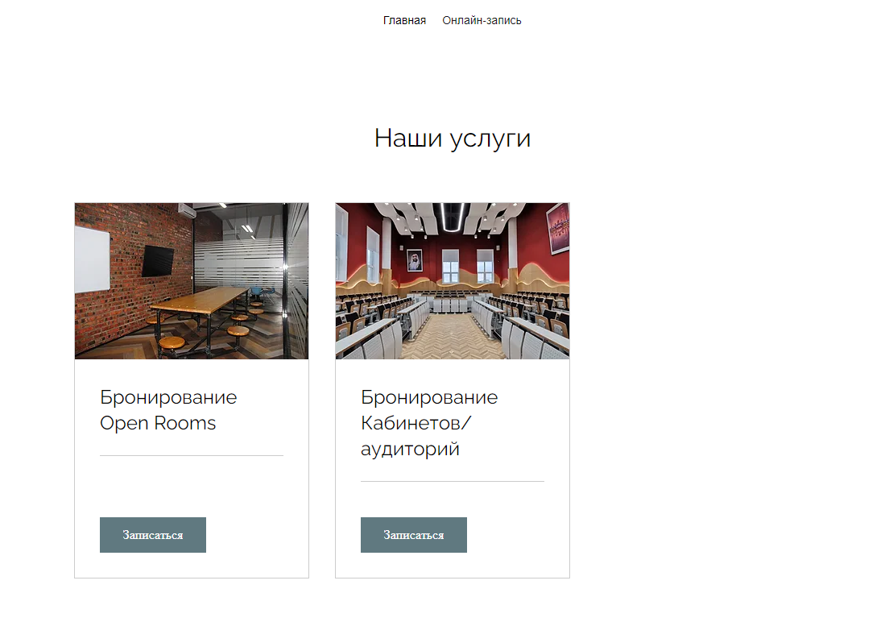

# Classroom/OpenRoom Booking System
Classroom booking system was built with  Node.js (Express), VueJS and SQLite.


## Table of Contents

* [Getting started](#getting-started)
  * [Prerequisites](#prerequisites)
  * [Installation](#installation)
  * [User can](#User)
* [Design](#design)
  * [Prototype](#prototype)
* [Development](#development)
  * [Requirements](#requirements)
  * [Tools](#Tools)
* [Team](#team)

## Getting started
These instructions will get you a copy of the project up and running on your local machine for development purposes.
### Prerequisites
#### Back-end:
- Node.Js
- Express
- SQLite

```JSON
  {
  "name": "booking-classrooms-api",
  "version": "1.0.0",
  "main": "index.js",
  "scripts": {
    "initdb": "node src/initdb.js",
    "start": "node src/index.js"
  },
  "keywords": [],
  "author": "",
  "license": "ISC",
  "dependencies": {
    "body-parser": "^1.20.2",
    "cors": "^2.8.5",
    "express": "^4.18.2",
    "path": "^0.12.7",
    "sqlite3": "^5.1.6"
  },
  "devDependencies": {
    "eslint": "^8.38.0",
    "eslint-config-standard": "^17.0.0",
    "eslint-plugin-import": "^2.27.5",
    "eslint-plugin-n": "^15.7.0",
    "eslint-plugin-promise": "^6.1.1"
  },
  "description": ""
}
```
#### Front-end:
- Vue.js
```json
{
  "name": "booking-classrooms",
  "version": "0.1.0",
  "private": true,
  "scripts": {
    "serve": "vue-cli-service serve",
    "build": "vue-cli-service build",
    "lint": "vue-cli-service lint"
  },
  "dependencies": {
    "@vuepic/vue-datepicker": "^4.3.0",
    "axios": "^1.3.5",
    "core-js": "^3.8.3",
    "express": "^4.18.2",
    "vue": "^3.2.13",
    "vue-router": "^4.0.3",
    "vuex": "^4.0.0"
  },
  "devDependencies": {
    "@babel/core": "^7.12.16",
    "@babel/eslint-parser": "^7.12.16",
    "@vue/cli-plugin-babel": "~5.0.0",
    "@vue/cli-plugin-eslint": "~5.0.0",
    "@vue/cli-plugin-router": "~5.0.0",
    "@vue/cli-plugin-vuex": "~5.0.0",
    "@vue/cli-service": "~5.0.0",
    "@vue/eslint-config-standard": "^6.1.0",
    "eslint": "^7.32.0",
    "eslint-plugin-import": "^2.25.3",
    "eslint-plugin-node": "^11.1.0",
    "eslint-plugin-promise": "^5.1.0",
    "sass": "^1.32.7",
    "sass-loader": "^12.0.0"
  },
  "description": "## Project setup ``` npm install ```",
  "main": ".eslintrc.js",
  "author": "",
  "license": "ISC"
}
```
### Installation
First of all you need to install Node.js on your machine:

[https://nodejs.org/en]


Clone the repository
```
git clone https://github.com/mehboooo
```

After installation and cloning repository, you have to open terminal in project. In the main folder initiate "npm".
```
npm init

keep pushing button "enter" until don't get confirmation
```

After initiation npm, you have to download neccessary packages for the project.

Write this commands in terminal

Front-end folder:
```
npm i express
npm i body-parser
npm i axios
npm i core-js
npm i vue
npm i vue-router
npm i vuex
```
Back-end folder:
```
npm i express
npm i body-parser
npm i cors
npm i path
npm i sqlite3
```

### Go to the Back-end folder and start the server.
```
npm start
```

### Go to the Front-end folder and run the website.
Compiles and hot-reloads for development
```
npm run serve
```

Compiles and minifies for production
```
npm run build
```

Lints and fixes files
```
npm run lint
```

Open in your browser and navigate to http://localhost:8080. You access the back-end on http://localhost:3000.

To see database you have to open [https://sqliteonline.com]

Click on "File", then open the database file, filename is "database.db".


#### User
Can

see if there are available rooms on a specific date, 
be able to pick a date and see an overview of all available rooms and availability for that date.

not be overwhelmed with data, select which floors that are displayed.

find out who has booked a specific room.

view future room bookings, be able to select a date using a calendar or search for a date.


## Design
We designed that website user friendly, website is simple and intuitivali easy to understand to make a booking/reservation.

### Prototype
[View prototype in Wix](https://ulmirasmirza.wixsite.com/booking-rooms/book-online)

#### Booking View


## Development

### Requirements
[x] Backend - Node.js
[x] Frontend - VueJS
[x] SQLite
[x] User interface
[x] Deploye back-end and front-end
[x] README


### Tools
- Node.js
- Express
- SQLite
- Vue.js

## Team
- Bauyrzhan
- Ulmiras